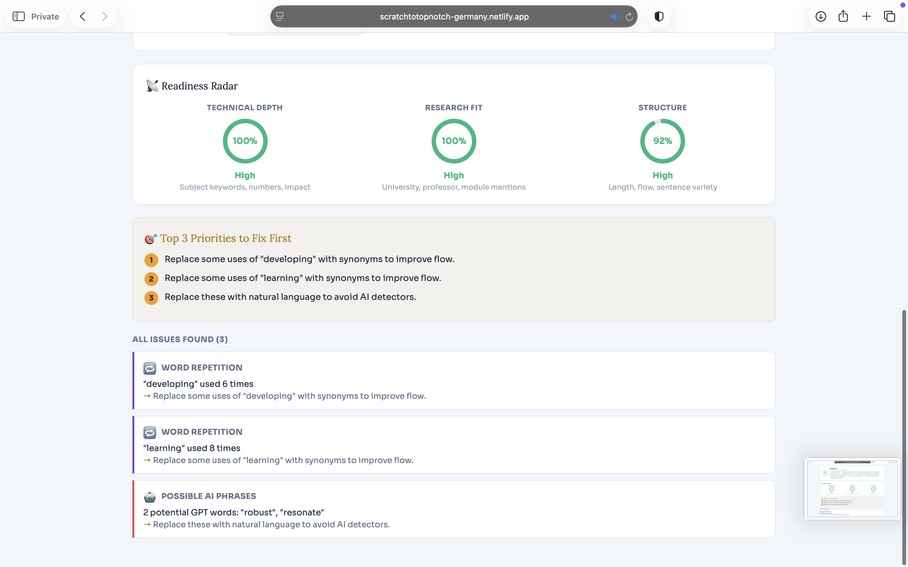

# 🇩🇪 ScratchToTopNotch — German University Finder

> A simple tool to help Indian students navigate the German admission process without expensive consultants.

🌐 **Live:** [scratchtotopnotch-germany.netlify.app](https://scratchtotopnotch-germany.netlify.app)

---

## 🚀 What is this?

I built this after going through the German university application process myself. I couldn't afford a consultant and spent weeks figuring out which universities accepted my CGPA, what a proper SOP looks like, and how much it actually costs to live in Germany. This tool packages everything I learned into one free platform.

---

## 📸 Screenshots

> Add your own screenshots to the `screenshots/` folder and update the paths below.

**University Finder — Safe / Moderate / Reach Results**



**SOP Analyser — Readiness Radar + 13 Checks**


**Cost of Living — City Comparison**


> 💡 To add screenshots: take a screenshot of the live app → save to a `screenshots/` folder in your repo → push to GitHub.

---

## 🛠️ Features

| Tool | Description |
|------|-------------|
| 🎓 **University Finder** | Match your CGPA, field, and budget against 40 German universities. Get Safe / Moderate / Reach tiers |
| ✍️ **SOP Analyser** | I researched the top reasons for SOP rejections and turned them into 13 automated checks |
| 📊 **ECTS Credit Matcher** | Check if your credits meet German university requirements |
| 💰 **Scholarship Finder** | DAAD, Erasmus+, Deutschlandstipendium and more |
| 📄 **LOR Generator** | Professional Letter of Recommendation in 3 tones |
| 🏠 **Cost of Living** | Real monthly estimates for 20 German cities |

---

## 💻 Tech Stack

| Layer | Technology |
|-------|-----------|
| Frontend | HTML5, CSS3, JavaScript (ES6+) |
| Backend | Python 3, FastAPI |
| Database | JSON (40 universities) |
| Frontend Deploy | Netlify |
| Backend Deploy | Render (uvicorn) |
| Version Control | Git + GitHub |

---

## 📁 Project Structure

```
scratchtotopnotch/
├── index.html          # Landing page
├── app.html            # Main application (6 tools)
├── main.py             # FastAPI backend
├── universities.json   # 40 German universities database
├── requirements.txt    # Python dependencies
└── netlify.toml        # Netlify config
```

---

## 🔧 Run Locally

```bash
# Clone the repo
git clone https://github.com/maheshwari-830/scratchtotopnotch.git
cd scratchtotopnotch

# Install Python dependencies
pip install -r requirements.txt

# Start the backend
uvicorn main:app --reload

# Open index.html or app.html in your browser
```

---

## 🌍 Deployment

- **Frontend** → [Netlify](https://netlify.com) — auto-deploys on every `git push`
- **Backend** → [Render](https://render.com) — Python web service at `scratchtotopnotch.onrender.com`

---

## ✍️ SOP Analyser — 13 Checks

| Check | Penalty | Why |
|-------|---------|-----|
| 🤖 AI Phrase Detector | -20 pts | Catches "delve", "multifaceted", "embark" |
| 📚 Subject Keyword Alignment | -20 pts | Missing CS/DS/IT keywords |
| 🔬 Professor & Module Specificity | -15 pts | No prof/module mentions |
| 💥 Impact Language | -12 pts | "built" vs "reduced by 40%" |
| 💤 Passive Voice | -10 pts | "was assigned" → "I led" |
| 🔄 "I" Counter | -10 pts | >60% sentences start with "I" |
| ⚠️ Generic Phrases | -7 pts each | 12 common phrases checked |
| 📏 Word Count | -20/-10 | Under 400 or over 1200 words |
| 🔢 Quantification | -15 pts | No numbers or percentages |
| 🏛️ University Name | -15 pts | Target university not mentioned |
| 🎯 Career Goals | -10 pts | No future direction stated |
| 🚪 Opening Hook | -8 pts | Weak opener detected |
| 🔁 Word Repetition | -5 pts | Same word used 6+ times |

**Output:** Score /100 + Readiness Radar (Technical Depth, Research Fit, Structure)

---

## 📄 License

Copyright © 2026 Maheshwari Saida. All rights reserved.

This code may not be copied, modified, or distributed without written permission from the owner.
View the live app at [scratchtotopnotch-germany.netlify.app](https://scratchtotopnotch-germany.netlify.app)
